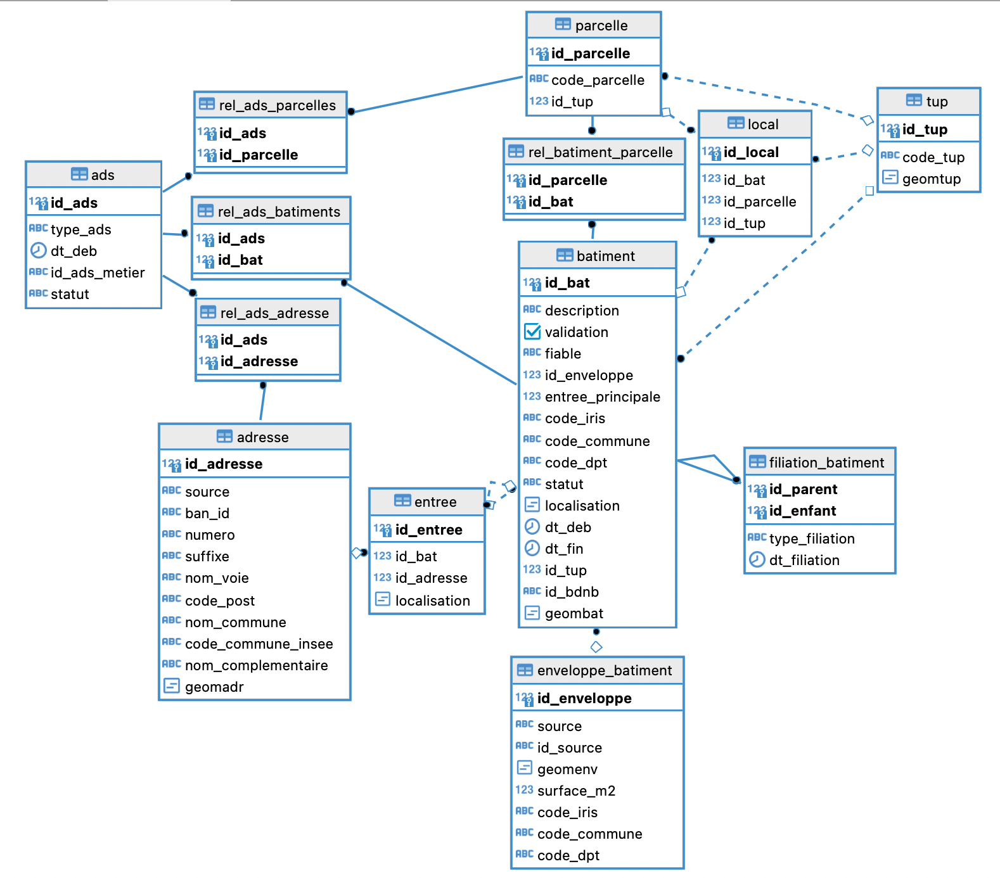

# Modèle de données du référentiel national des batiments

Le modèle de données est en cours de construction. Il est mis en avant ici afin d'alimenter les discussions.

Sans plus attendre, ci-dessous, le diagramme entitée relation et quelques éléments de contexte. 

- Le modèle de donnée bâtiment est intrinsèquement lié à la définition qui emergera pour cet objet. A ce stade, le prisme adopté ici, au dela de la notion commune autour de l'objet est qu'un batiment possède a minima une entrée exclusive. 

- Le lien entre le concept d'adresse et de batiment, se fait justement par le biais du concept d'entrée. 

- La notion d'enveloppe de batiment correspond à un objet géométrique, un polygone (par exemple la couche batiment de la BDTOPO IGN), découpé avec la géométrie des tables des parcelles unifiées issu du modèle CEREMA des Fichiers Fonciers. A ce stade, le prisme de découpage paraissant le plus probant est celui proposé par le CSTB. [Pour en savoir davantage, voir la riche documentation proposée dans le cadre de la base nationale des batiments](https://gitlab.com/BDNB/base_nationale_batiment/-/wikis/M%C3%A9thodologie/methodologie-de-croisement).

- La notion de local est aussi intrinsequement liée à cette échelle batiment. Elle sera développée plus amplement dans un second temps, en coordination avec l'initiative du réppertoire des locaux mené par le Direction Générale des Finances Publiques.

- Enfin, dans l'hypothèse d'un référentiel de batiment, alimenté par les processus administratifs, sont présents dans le modèle, un lien avec les autorisation du droits des sols (ADS), comme les permis de construire.

Pour finir,  [`un fichier`](./src/db/data_dict_batiment.xlsx) est disponible au format excel, permettant d'accéder à une descriptif (encore très succins) des diverses tables et de leur attributs. 
