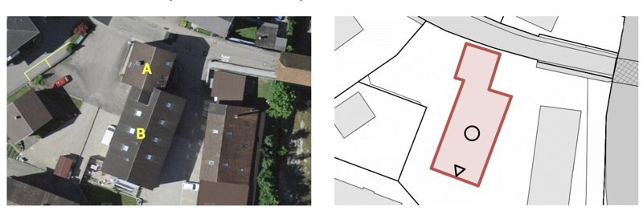
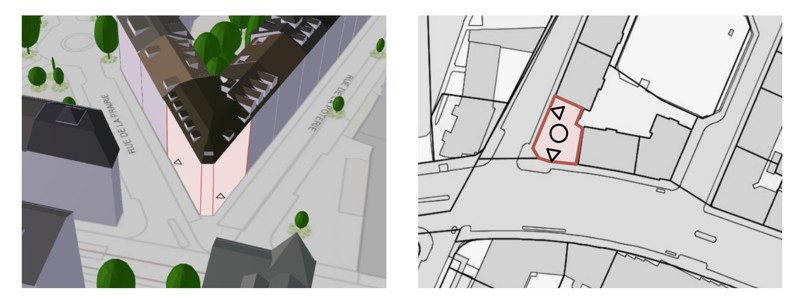
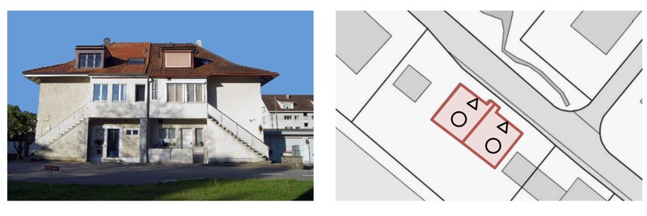
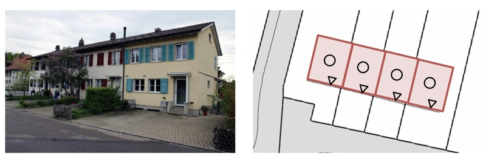

# Appel à Commentaires: Élaboration d’un standard CNIG pour une définition du terme “Bâtiment” 

_Version 0.1_

_Rédaction : Elisabeth Talbourdet Ville & Félix Veith, entrepreneurs d'intérêt général au sein de l’ADEME et du CSTB, pour le Groupe de Travail Bâti du Conseil National de l’Information Géolocalisée (CNIG)._

_Sept. 2022_

##  Table des Matières

<!-- TOC -->
* [Appel à Commentaires: Élaboration d’un standard CNIG pour une définition du terme “Bâtiment”](#appel--commentaires--laboration-dun-standard-cnig-pour-une-dfinition-du-terme-btiment)
  * [Table des Matières](#table-des-matires)
  * [1. Introduction](#1-introduction)
  * [2. Le besoin d’adopter une définition unique et partagée](#2-le-besoin-dadopter-une-dfinition-unique-et-partage)
  * [3. La définition et commentaires sur les termes](#3-la-dfinition-et-commentaires-sur-les-termes)
  * [4. Descriptif complémentaire des bâtiments dans le Référentiel National des Bâtiments](#4-descriptif-complmentaire-des-btiments-dans-le-rfrentiel-national-des-btiments)
    * [A. Objectif du descriptif complémentaire](#a-objectif-du-descriptif-complmentaire)
    * [B. Critère d’exclusion](#b-critre-dexclusion)
    * [C. Distinction entre un bâtiment et un local](#c-distinction-entre-un-btiment-et-un-local)
    * [D. Distinction entre les bâtiments et d’autres types de constructions](#d-distinction-entre-les-btiments-et-dautres-types-de-constructions)
      * [Les cas particuliers d’ouvrage d’art](#les-cas-particuliers-douvrage-dart)
      * [Comment traiter les bâtiments provisoires ?](#comment-traiter-les-btiments-provisoires-)
    * [E. Distinction entre un bâtiment unique et plusieurs bâtiments](#e-distinction-entre-un-btiment-unique-et-plusieurs-btiments)
      * [Bâtiment individualisé](#btiment-individualis)
        * [Maison individuelle](#maison-individuelle)
      * [Bâtiment administratif, commercial, entrepôt, industriel](#btiment-administratif-commercial-entrept-industriel)
      * [Bâtiment abritant des activités humaines uniquement (sans abriter des humains)](#btiment-abritant-des-activits-humaines-uniquement--sans-abriter-des-humains-)
      * [Objet autre, qui est une annexe contiguë d’un bâtiment](#objet-autre-qui-est-une-annexe-contigu-dun-btiment)
      * [Bâtiments dont une partie (ex. une extension) n’a pas d’accès depuis l’extérieur](#btiments-dont-une-partie--ex-une-extension--na-pas-daccs-depuis-lextrieur)
      * [Bâtiment/ Immeuble ayant plusieurs logements (et parfois plusieurs entrées )](#btiment-immeuble-ayant-plusieurs-logements--et-parfois-plusieurs-entres-)
      * [Bâtiment léger (Bungalow, cabine en bois, kiosk)](#btiment-lger--bungalow-cabine-en-bois-kiosk-)
    * [Bâtiments distincts](#btiments-distincts)
      * [Maisons jumelées (mitoyenne)](#maisons-jumeles--mitoyenne-)
      * [Maisons en rangée](#maisons-en-range)
      * [Bâtiment annexe contigu/autonome](#btiment-annexe-contiguautonome)
      * [Bâtiments reliés par une construction souterraine](#btiments-relis-par-une-construction-souterraine)
      * [Bâtiments découpés par des limites géographiques (Communes, cadastre, etc)](#btiments-dcoups-par-des-limites-gographiques--communes-cadastre-etc-)
  * [Ressources](#ressources)
<!-- TOC -->

## 1. Introduction

> “Ne pas faire une définition en fonction de ce qu’on est capable de produire mais plutôt en fonction de ce que l’on veut faire” - IGN 

L’Agence de la Transition Écologique (ADEME) a pour mission de contribuer à la mise en œuvre du plan de rénovation énergétique des bâtiments, qui vise à développer des outils adaptés afin de massifier la rénovation énergétique, tant des logements que des bâtiments tertiaires. Malheureusement, **le croisement difficile entre les différentes bases de données pertinentes **empêche une description fine des bâtiments, et donc le suivi des rénovations effectuées. 

C’est pourquoi l’ADEME et le Centre Scientifique et Technique du Bâtiment (CSTB) ont initié depuis septembre 2021 **le projet dit « Bat-ID »** en participant au programme Entrepreneurs d’Intérêt Général (EIG) de la Direction Interministérielle du Numérique. Ce programme de 10 mois a permis l’intégration de deux EIG (Mme. Elisabeth Talbourdet-Ville et M. Félix Veith) au sein du service bâtiment de l’ADEME, dont la mission est de **contribuer à la création du référentiel national du bâtiment et d’un identifiant unique associé qui deviendra un véritable pivot pour croiser les jeux de données pertinents entre eux.**

Dans le cadre de cette mission, des travaux de recherches utilisateurs ont été ainsi menés par les équipes de Bat-ID pour déterminer un recueil des besoins et des usages d’un tel référentiel. Lors de ces travaux de recherche (dont la synthèse est [disponible ici](https://github.com/entrepreneur-interet-general/BatID/blob/main/docs/Rapport-Phase-1-Bat-ID.pdf)), il est apparu que la problématique d’aboutir à une définition commune de l’objet “bâtiment” est l’un des principaux enjeux du projet Bat-ID. Il ressort également de l’étude des précédentes initiatives que la définition du bâtiment est l’une des raisons pour lesquelles les projets d’identifiant unique n’avaient jusqu’ici pas abouti. 

Afin d’atteindre cet objectif, et pour permettre de fédérer l’ensemble des acteurs intéressés par la problématique autour de ces premières analyses, l’équipe du projet Bat-ID a été chargée par le Conseil National de l’Information Géolocalisée (CNIG) d’animer le Groupe de Travail du Bâtiment en s’appuyant sur les travaux de définition menés précédemment par le projet Bat-ID (dont la synthèse est disponible [ici](https://github.com/entrepreneur-interet-general/BatID/blob/main/docs/Synthe%CC%80se-Ateliers-de-De%CC%81finition-Bat-ID.pdf)).  \

Les travaux de celui-ci doivent permettre aux parties prenantes institutionnelles d’aboutir à une définition partagée de l’objet “bâtiment” pour la création du référentiel. Ce travail est complété par l’apport plus large de la communauté s’intéressant au sujet des données bâtimentaire via les forums de collaboration en ligne: 

* [https://forum.geocommuns.fr](https://forum.geocommuns.fr)
* [https://teamopendata.org/t/identifiant-unique-batiment/2899/29](https://teamopendata.org/t/identifiant-unique-batiment/2899/29) 
* [https://github.com/entrepreneur-interet-general/BatID/issues/12](https://github.com/entrepreneur-interet-general/BatID/issues/12) 

Ces travaux sont désormais ouverts à l’appel aux commentaires de l’ensemble des membres du CNIG.

## 2. Le besoin d’adopter une définition unique et partagée

Dans le cadre de la création du référentiel national du bâtiment (RNB), il convient d’approcher la définition du bâtiment en tant **qu’objet fonctionnel**. En effet, l’objectif est de répondre aux principaux problèmes que rencontrent les utilisateurs des données bâtimentaires aujourd’hui, à savoir: 

* La complexité du croisement de l’information et ses conséquences, 
* La latence et la fiabilité dans la représentation du parc
* Le manque d’information sur l’historique du bâtiment. 

Bien qu’elle se veuille la plus générique possible, surtout vis à vis des définitions existantes qui ne se concentrent que sur un cas d’usage spécifique, la définition du bâtiment **dans le cadre de ce référentiel** a pour but de répondre à ces besoins. 

Afin que ce référentiel soit le plus utilisé possible, la définition du bâtiment doit être concise, appréhendable selon le sens commun et permettent facilement d’identifier ce qu’est un bâtiment et discriminer les bâtiments entre eux. 

## 3. La définition et commentaires sur les termes

La définition proposée par le groupe de travail “Bâti” au fil des trois premières sessions et des commentaires des membres du groupe en [asynchrone](https://github.com/entrepreneur-interet-general/BatID/issues/12) est la suivante :

**Construction souterraine ou au-dessus du sol, ayant pour objectif d'être permanente, pour abriter des humains ou des activités humaines et ayant une surface minimum de 5 m2.** 
 
**Un bâtiment possède a minima un accès depuis l’extérieur et peut être distingué d’un autre par une séparation non-franchissable du sol au toit, qui ne permet pas la circulation entre les bâtiments.** 
 
**Un bâtiment peut rassembler un ou plusieurs locaux**

Suite au groupe de travail n°4, une nouvelle définition est proposée : 

**Construction souterraine et/ou au-dessus du sol, ayant pour objectif d'être permanente, pour abriter des humains ou des activités humaines.** 

**Un bâtiment possède a minima un accès depuis l’extérieur et dans la mesure du possible, un bâtiment est distinct d’un autre dès lors qu’il est impossible de circuler entre eux.**
 

Plusieurs aspects de cette définition doivent être éclaircis et font appel à commentaires :

* **Souterraine et/ou au-dessus du sol**
  * La directive INSPIRE propose d’inclure la représentation des bâtiments souterrains;
  * Ces bâtiments sont néanmoins plus difficiles à identifier en pratique;
  * Pour cette raison, les bâtiments souterrains sont compris dans la définition et le modèle de données mais leur recensement au sein du référentiel aura lieu dans un second temps, après avoir traité la question des bâtiments hors-sols dans un premier temps.

* **Objectif de permanence**
    * La définition du bâtiment doit exclure les constructions temporaires qui n’ont pas vocation à être implémentées dans la durée pour assurer le maintien d’une base de données fiables et représentative de la réalité terrain.
    * Le choix des termes “objectif de permanence” est délibérément large, pour laisser la possibilité de refléter les différentes manières de définir un bâtiment temporaire qui existent aujourd’hui. 
    * Le bâtiment temporaire peut en effet être défini : 
        * _Soit par un critère de durée_ : Une installation temporaire pourrait être définie au sens “construction provisoire" de l**’article R.421-5 du code de l’urbanisme**, c’est à dire d’une durée de moins de **3 mois**. 
            * Une autre durée, plus longue, pourrait également être envisagée : à titre d’exemple le RegB-L Suisse tient compte de tous les bâtiments ayant vocation à être érigés pour une durée de moins de 5 ans.
        * _Soit par un critère lié à son usage_: Une construction ayant vocation à être détruite/ démontée au terme de son usage. Cela permettrait notamment d’inclure dans la définition du bâtiment “l’habitat léger” ou “architecture mobile”, qui n’impactent pas le foncier et le sol sur le temps long mais peuvent être néanmoins inclus dans la définition, ce qui a été suggéré par l’ADEME.
        * _Soit par un critère de conception_, en tenant compte de la notion «d’ancrage ou fondation » ou de “perpétuelle demeure”, en étudiant si l’objet à soit une dalle, soit vocation à être déplacée, soit la possibilité d’être installée ailleurs ou démontée sans être cassée, ou sans subir d’aménagements lourds. \

* **Notion d'abriter des humains et des activités humaines**
    * Le terme « abriter » doit s’entendre au sens d’une protection des éléments extérieurs et intempéries.
    * Il a été évoqué la possibilité de remplacer ce terme par les termes "_clos & couvert_" mais qui ont été jugés trop limitatifs et difficiles à implémenter dans le référentiel car il semble complexe de vérifier qu’un bâtiment est bien clos sans intervention humaine. \

* **A minima un accès depuis l’extérieur**
    * Il a été évoqué l’idée d’avoir une notion “d’entrée principale” - néanmoins le terme “entrée” implique potentiellement plusieurs types d’usages différent (accès pour le facteur, pour le particulier, pour les services d’urgences) et il a été privilégié l’idée de recenser toutes les entrées plutôt qu’en désigner une comme étant “principale”.
    * Cette notion d’entrée permet de faire le lien avec la notion d’adresse et notamment la Base d’Adresse Nationale. \

* **Différencier un bâtiment d'un autre** : dans la mesure du possible, un bâtiment est distinct d’un autre dès lors qu’il est impossible de circuler entre eux **
    * L’objectif de cette distinction est de permettre aux contributeurs du référentiel de différencier les bâtiments des uns des autres dans le cas général, donc la circulation entre bâtiments mitoyens qui ne pourraient pas être distingués les uns des autres par vues aériennes par exemple. 
    * Pour autant, il est clair que ce découpage devra être adapté par chaque utilisateur selon le niveau d’information dont il dispose.

## 4. Descriptif complémentaire des bâtiments dans le Référentiel National des Bâtiments

### A. Objectif du descriptif complémentaire

Ce descriptif complémentaire est à destination des utilisateurs et contributeurs du Référentiel National des Bâtiments (RNB) chargés de saisir et mettre à jour les données sur les bâtiments. Ce document sert de guide et n’est pas une liste exhaustive de l’ensemble des cas spécifiques qui pourraient se présenter.

Dans une démarche itérative, le RNB sera construit dans un premier temps avec les bâtiments au-dessus du sol, et ce document a pour objectif de préciser certains cas d’application dans lesquels la détermination d’un ou plusieurs bâtiments est sujet à débat. Ce document sert de guide et n’est pas une liste exhaustive de l’ensemble des cas spécifiques qui pourraient se présenter.

L’expérience montre que les différents utilisateurs de la donnée bâtimentaire n’ont pas la même manière d’envisager l’entité “bâtiment” ce qui peut compliquer l’échange d’information. C’est pourquoi nous avons créé ce descriptif, afin d’apporter de la clarté dans l’appréhension de la définition des bâtiments dans le RNB.

### B. Critère d’exclusion

Chaque usager du référentiel peut librement décider d’inclure un bâtiment sans limite de surface dès lors qu’il juge son référencement pertinent (ex. il est important de connaître l’existence d’un garage de 5 m2 en zone dense). 

Cependant afin de guider au mieux les utilisateurs du référentiel, un seuil de 5m2 peut être retenu comme une surface minimale pour prendre en considération la construction. En effet, ce seuil correspond à la surface à partir de laquelle une [Déclaration Préalable](https://www.service-public.fr/particuliers/vosdroits/F17578) est à faire auprès des services de l'urbanisme de la collectivité. 

En deçà, il serait notamment difficile de mettre en place des flux d'alimentation pour des bâtiments plus petits, car non sujet à des règles administratives

### C. Distinction entre un bâtiment et un local

Un bâtiment peut rassembler un ou plusieurs locaux. Cette précision a pour objectif d’éviter toutes potentielles ambiguïtés entre les objets “bâtiment” et “local” au sein de la définition sémantique retenue. 

Ce lien local-bâtiment sera notamment précisé dans le modèle de données.

Un local s’entend ici au sens retenu des processus administratifs de la direction générale des finances publiques tel que désigné par son invariant fiscal.

### D. Distinction entre les bâtiments et d’autres types de constructions

Cette section vise à déterminer les types de constructions et autres objets ne correspondant pas formellement à la définition des bâtiments proposée par le groupe de travail du CNIG.

Cette liste, non exhaustive, permet aux utilisateurs du RNB de classifier certaines structures dans une catégorie “autres constructions”.

<table>
  <tr>
       <td>    
     <em> Piscine, y compris les piscines couvertes</em>
   </td>
   <td> 
<em>

Barrières, clôtures </em>
   </td>
   <td> 
<em>Simple toit ouvert </em>
   </td>
   <td> 
<em>Kiosque, Arche, Monuments </em>
  </tr>
    <tr>
       <td>    
     <em>
Ruine</em>
   </td>
   <td> 
<em>

Cabine de plage de moins de 5 m2 </em>
   </td>
   <td> 
<em>Abri de jardin de moins de 5 m2
 </em>
   </td>
   <td> 
<em>Abri animalier  </em>
  </tr>
    <tr>
       <td>    
     <em> Conteneur de chantier</em>
   </td>
   <td> 
<em>

Tente </em>
   </td>
   <td> 
<em>Arrêt de transport public </em>
   </td>
   <td> 
<em>Local/abri d’attente </em>
  </tr>
  <tr>
       <td>    
     <em>

Abri pour deux roues </em>
   </td>
   <td> 
<em>

Petits boîtiers de distribution électrique </em>
   </td>
   <td> 
<em>

Parcs photovoltaïques </em>
   </td>

  </tr>

  </table>

#### Les cas particuliers d’ouvrage d’art

Liste non exhaustive de constructions n’étant pas un bâtiment à intégrer au sein du référentiel mais un simple ouvrage d’art.

<table>
  <tr>
       <td>    
     <em> 

Ponts </em>
   </td>
   <td> 
<em>

Routes </em>
   </td>
   <td> 
<em>

Barrages </em>
   </td>
   <td> 
<em>

Tunnels, galeries </em>
  </tr>
  </table>

#### Comment traiter les bâtiments provisoires ?

Chaque contributeur au référentiel peut évaluer le caractère permanent ou non d’une construction. Par exemple, une construction provisoire érigée pour une durée excédant une durée réglementaire (qui peut varier selon les cas) et qui est solidement fixés au sol, est considérée comme un bâtiment.
<table>
<tr>
   <td> 
   </td>
   <td> 
   </td>
</tr>
</table>

A l’inverse, une yourte ou un mobil-home qui est installée pour une durée saisonnière (ex. l’été) n’est pas considérée comme un bâtiment devant être inclus dans le référentiel.

Les règles de distinction à appliquer sont les mêmes que pour les bâtiments individualisés. 

### E. Distinction entre un bâtiment unique et plusieurs bâtiments

L’objectif de cette section est de faciliter l’identification et le découpage d’un ou plusieurs bâtiments pour les utilisateurs du référentiel. La représentation des cas cités ci-dessous au sein du référentiel est accompagnée d’une explication succincte permettant de détromper certains cas complexes. 

Cette liste n’est pas exhaustive et à vocation à être complétée au fil de la construction du référentiel. 

#### Bâtiment individualisé 

##### Maison individuelle

Il doit être défini comme un bâtiment unique lorsqu’il forme un tout et qu’il ne comporte pas de locaux (comme un garage) qui possèdent un accès depuis l’extérieur sans être accessible depuis l’intérieur. 

Les exemples, moins communs, de ce type de bâtiment sont notamment (liste non-exhaustive) :

<table>
  <tr>

<td>    
     <em> 

Les phares </em>
   </td>
<td>    
     <em> 

Les maisons troglodytiques </em>
   </td>
<td>    
     <em> 

Les cabanes dans les arbres habitées </em>
   </td>
  </tr>
</table>

#### Bâtiment administratif, commercial, entrepôt, industriel

Il doit être défini comme un bâtiment unique lorsqu’il forme un tout et n’est pas divisé par une séparation infranchissable, ou ne possède pas plusieurs accès depuis l’extérieur.	

Les exemples de ce type de bâtiment sont notamment (liste non-exhaustive) :

<table>
  <tr>
       <td>    
     <em>

Les bâtiments industriels accueillant du public (ex. centre commercial, commerces, supermarchés) </em>
   </td>
   <td> 
<em>

Les bâtiments industriels de stockage (entrepôt, hangar, parking couvert) </em>
   </td>
   <td> 
<em>Les bâtiments de bureaux</em>
   </td>
   <td> 
<em> Les bâtiments à usage récréatif ou culturel</em>
  </tr>
  <tr>
       <td>    
     <em> 

Les musées ou bibliothèques </em>
   </td>
   <td> 
<em>

Les écoles, universités ou bâtiments dédiés à la recherche </em>
   </td>
   <td> 
<em>Les hôpitaux et établissements de santé

 </em>
   </td>
   <td> 
<em>Les salles de sport, gymnases et complexes sportifs</em>
  </tr>
 </td>
   <td> 
<em> 

Les édifices culturels et religieux (ex. église, cathédrale, synagogue, mosquée, chapelle)</em>
       <td>    
     <em> 

Les bâtiments d’exploitation des terrains de camping</em>
   </td>

  </table>

#### Bâtiment abritant des activités humaines uniquement (sans abriter des humains)

Les exemples de ce type de bâtiment sont notamment (liste non-exhaustive) :
<table>
  <tr>
<td>    
     <em>

Les bâtiments d’exploitation agricole 

(ex. étable, serre, grange, écurie, ferme…) </em>
   </td>
   <td> 
<em>

Les grandes éoliennes </em>
   </td>
   <td> 
<em>

Les réservoirs & silos agricoles</em>
   </td>

   <td> 
<em>

Les postes de transformation électrique suffisamment grands </em>
   </td>

  </tr>
</table>

#### Objet autre, qui est une annexe contiguë d’un bâtiment

Une annexe contiguë est saisie avec le bâtiment principal si l’on peut circuler de l’un à l’autre et n’existe pas de délimitation non franchissable.

#### Bâtiments dont une partie (ex. une extension) n’a pas d’accès depuis l’extérieur

Si la partie A ne possède pas d’accès depuis l'extérieur et est accessible depuis la partie B, cet ensemble forme bien un unique bâtiment. Par exemple, une extension ou aménagement d’un bâtiment existant (ex. véranda), qui n’implique pas la création d’un nouveau bâtiment.

#### Bâtiment/ Immeuble ayant plusieurs logements (et parfois plusieurs entrées )

Dans l’illustration ci-dessus, il s’agit d’une immeuble donnant accès à plusieurs logements en son sein, il constitue donc bien un seul bâtiment.  

Dans le cas de l’immeuble ci-dessus, il est à considérer comme un seul bâtiment si les espaces communs permettent de passer d’une entrée à l’autre (il n’existe ainsi donc pas de séparation non franchissable de l’un à l’autre, c’est bien un unique bâtiment).

#### Bâtiment léger (Bungalow, cabine en bois, kiosk)

Ce cas d’usage représente finalement le cas des objets n’ayant pas de fondation.
A priori, si ceux-ci répondent aux exigences de la définition, ils doivent être considérés comme des bâtiments.

Cela implique donc de considérer comme bâtiments, sous réserve d’un objectif de permanence, les objets suivants 

<table>
  <tr>
<td>    
</td>
   <td> 
   </td>
   <td> 
   </td>

  </tr>
</table>

Dans les cas ci-dessus, dès lors que la construction même légère a vocation à être utilisée de manière permanente alors elle doit être considérée comme un bâtiment.

### Bâtiments distincts

#### Maisons jumelées (mitoyenne)

Les maisons jumelées sont définies comme deux bâtiments lorsqu’on ne peut pas circuler de l’une à l’autre depuis l’intérieur.

#### Maisons en rangée

Les maisons en rangée sont bien à saisir séparément tant qu’on ne peut circuler de l’une à l’autre. 

#### Bâtiment annexe contigu/autonome

Une annexe est saisie comme un bâtiment autonome s’il possède son propre accès depuis l’extérieur et qu’on ne peut pas circuler entre les deux bâtiments depuis l’intérieur.

#### Bâtiments reliés par une construction souterraine

Dans le cas de bâtiments reliés par une construction souterraine (par exemple un garage ou une cave communes):

- Concernant les bâtiments extérieurs, il y a autant de bâtiments à considérer que s’il n’y avait pas eu de garage souterrain. (Dans le cas de l’exemple ci dessus, nous avons 3 maisons individuelles reliées par un garage souterrain, et donc 3 bâtiments distincts);
- Concernant la partie du garage en sous-sol, une documentation supplémentaire sera dédiée à ce sujet.	

<table>
  <tr>
<td>    
</td>
  </tr>
</table>

Idem, dans le cas d’une barre d’immeuble avec plusieurs cages d’escalier non communicantes en dehors des cages et garages souterrains, on a bien autant de bâtiments que de cages d’escaliers (accès distinct depuis l’extérieur). Cet aspect est notamment primordial pour les interventions des services d’urgences qui doivent pouvoir identifier rapidement le point d’accès à un lieu d’intervention dans l’immeuble.

#### Bâtiments découpés par des limites géographiques (Communes, cadastre, etc) 

De façon générale, les limites géographiques ne sont pas un critère pour délimiter, découper les bâtiments. Un bâtiment peut être situé à la frontière de deux communes, il est tout de même à considérer comme un seul bâtiment.

Bien qu’un bâtiment puisse être segmenté par une frontière géographique, celle-ci ne doit pas venir bousculer la définition, les mêmes règles de dénombrement/détrompage s’appliquent. 

La seule question ici, qui est plutôt d'ordre de la modélisation de la donnée bâtimentaire, pourrait résider dans l’appartenance du bâtiment à une zone géographique. Sa commune de rattachement pourrait être celle des démarches d’urbanisme, où de l’adresse utilisée pour l’imposition. Bien qu’important, cela reste des cas marginaux, à traîter au moment opportun.

Quid de la délimitation internationale et le besoin de cohérence dans le dénombrement du bâti à cette échelle ? C’est un cas extrêmement particulier dont la réflexion sera menée en temps voulu, et mis de côté pour l’instant. 

## Ressources

- [Annexe à la saisie des batiment Suisse](https://www.bfs.admin.ch/bfs/fr/home/statistiques/catalogues-banques-donnees/publications.assetdetail.13147437.html) 
- [European directive INSPIRE](https://inspire.ec.europa.eu/id/document/tg/bu)
- [https://wiki.openstreetmap.org/wiki/FR:Page_principale](https://wiki.openstreetmap.org/wiki/FR:Page_principale)  // [https://wiki.openstreetmap.org/wiki/FR:%C3%89l%C3%A9ments_cartographiques](https://wiki.openstreetmap.org/wiki/FR:%C3%89l%C3%A9ments_cartographiques) 

